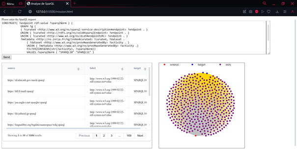

This library is a javascript library created in order to facilitate the creation of visualizations to represent the result of SPARQL queries. When used, a website page is temporarily created, allowing the user to submit a SPARQL request, and obtain the results in a table and in a node-link diagram. Later, a graph pattern will be added to the page.

# Développer graph pattern

This document focus on the code, and is directed toward a Javascript developper that wishes to reuse the code.

# Website presentation

The website is a simple html page containing for the moment 3 major differents parts, as depicted in the figure below.
Hereafter, you will find the description of each part.



## Part 1 : Text Area

The Text Area is the part where the user can enter the SPARQL request which he wants to see the graph of. Once the request is written, the user just have to use the "send" button under the Text Area.

Once the send button is clicked, the results are put in an object named "result_data", and the edges (columns representing the source, target, and link) are defined manually in the code. In the futur, those edges will be choosen on the website by the user.

Then, these results and the edges are send in 3 different functions to create the nodes (buildNodes), the links (buildLinks), and the legend (buildLegend). Those 3 elements are finally put in a json object, which is the dataset that the next functions will use. For the next examples, it will be called "dataset_nodelink".

The dataset obtained should look like this:

```javascript

{
  let  dataset_nodelink = {
    nodes : [
      {
        col : s,
        id : "https://id.nlm.nih.gov/mesh/sparql",
        label : "https://id.nlm.nih.gov/mesh/sparql",
        place : "mix",
        zoom : false,
      },
      {
        col : o,
        id : "SPARQL10",
        label : "SPARQL10",
        place : "target",
        zoom : false,
      },
      {
        col : s,
        id : "https://ldf.fi/mufi/sparql",
        label : "https://ldf.fi/mufi/sparql",
        place : "mix",
        zoom : false,
      },
      ...
    ],
    links : [
      {
        color : "gold",
        id : 0,
        label : "http://www.w3.org/1999/02/22-rdf-syntax-ns#value",
        source : "https://id.nlm.nih.gov/mesh/sparql",
        target : "SPARQL10"
      },
      {
        color : "gold",
        id : 1,
        label : "http://www.w3.org/1999/02/22-rdf-syntax-ns#value",
        source : "https://ldf.fi/mufi/sparql",
        target : "SPARQL10"
      },
      {
        color : "gold",
        id : 2,
        label : "http://www.w3.org/1999/02/22-rdf-syntax-ns#value",
        source : "https://jsu.eagle-i.net/sparqler/sparql",
        target : "SPARQL10"
      },
      ...
    ],
    legend : [
      {
        label : "source",
        value : "s"
      },
      {
        label : "target",
        value : "o"
      },
      {
        label : "source",
        value : "p"
      }
    ]
  }
}

```


## Part 2 : Table

The table uses the Grid.js library. This library grants the base of the table, it is a necessary import.
You can access it online at this address : https://gridjs.io/docs/install

The table presents the SPARQL results from the select. Those values are spread into x columns, based on the variables given in the select part of the request (meaning ?s, ?p, ?o).

The table displays by default 10 lines of data at a time.

The function render the table and requires only one parameter that is the dataset. The table will be situated just below the Text Area, but you can modify its position in the html file.

```javascript

table_creator(dataset_nodelink)

```

## Part 3 : Nodelink Diagram

The nodelink diagram is the visualisation of the graph result based on the query sent by the user.

The graph results view is a nodelink representing the graph result based on the query sent by the user. A default graph is created when the request is sent, but the user will be able to modify it.

The only mandatory parameter is the dataset, all other paramaters are optionnal.

```javascript

nodelink_creator(dataset_nodelink)

```

To personnalize the graph render, the color parameter can be changed. By default, the source nodes are red, and the target nodes are blue. If a node is both source and target, then node colors are mixed. This means that if a node is both in the source list of nodes and in the target list of nodes (if there are for example multiple edges), its default color is purple (mix of blue and red).

The user can zoom on the graph (by scrolling) or on specific nodes (by clicking on those nodes). The strength of the zoom on each node can be defined thanks to the zoom_strenght parameter. The user can also see the label of each node and each link in a specific area below the table, when their mouse hover over the node or link in question.

The user can define the repulsive force between the nodes thanks to the strength parameter. By default, the value is -50.
The user can also change the size of the overall svg, changing its width and/or his height.

Finally, the last parameter is the number of ticks. When the page is reset, there is an effect where we can see all the nodes getting in position. The number of ticks define the maximum amount of mouvement from the nodes. It can allow the user to stop the nodes earlier if the program takes too much time.

Here is a call with all parameters : 

```javascript

nodelink_creator(dataset_nodelink,
                ["green", "yellow"], mixed_color = "blue",
                strength = -100, width = 300, height = 300,
                node_named = true, link_named = false,
                node_zoom = true, zoom_strenght = 3,
                number_ticks = 200)

```

Not all the parameters are mandatory, you can here see an example of a call with only some parameters.

```javascript

nodelink_creator(dataset_nodelink, undefined, "gold", -25, 500, undefined, false, true, false)

```

# Future work

Add a support interaction that enable the user to choose the color of different elements of the vizualisation.

Allow to change the number of lines display in the table.

Allow the user to choose which column is defined as source, target, and link.
